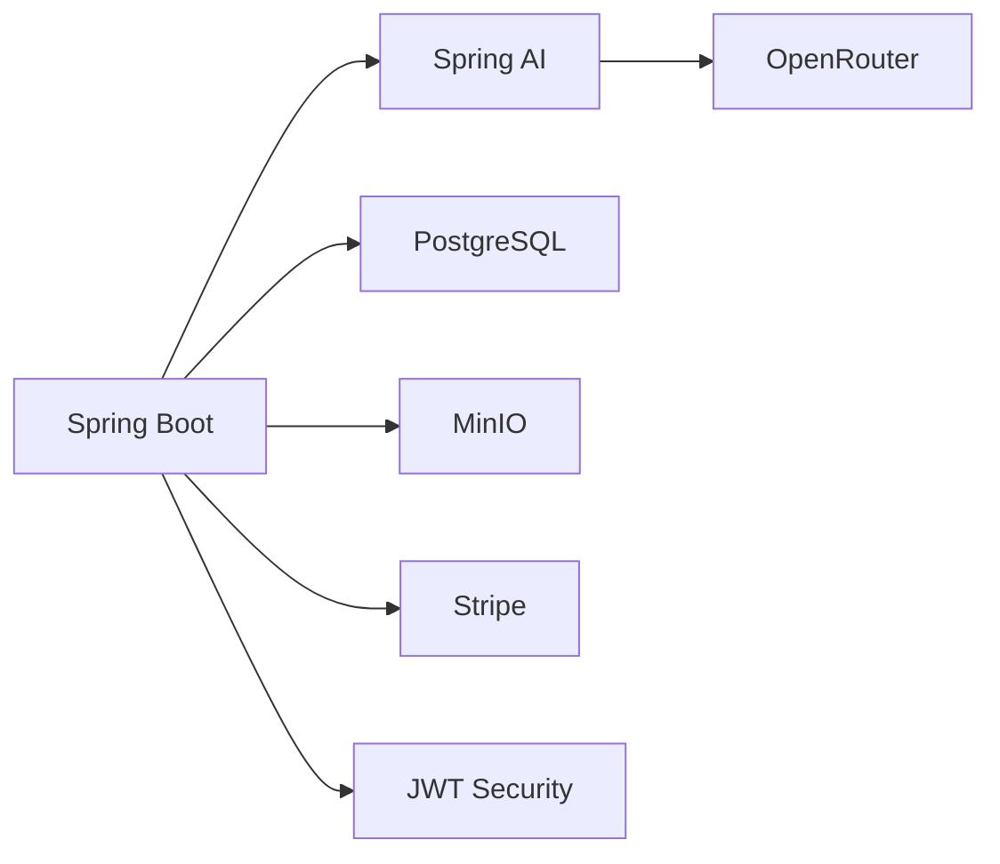

#  Hey, I'm Jashwant

<div align="center">


</div>

---

## ⚡ About Me

```java
public class Jashwant {

    String role = "Backend Engineer @ Harman";
    
    String[] expertise = {
        "Java",
        "Spring Boot",
        "Microservices",
        "System Design",
        "Spring Security",
        "PostgreSQL",
        "Docker",
        "Kubernetes"
    };

    int dsaProblemsSolved = 1500;

    String currentFocus =
        "Building scalable AI-powered backend systems";

    String lifeMotto =
        "Optimize. Scale. Repeat.";
}
```

---

# 🧠 DSA Grind Never Stops

<div align="center">

## 🔥 1500+ Problems Solved

### LeetCode

👉 https://leetcode.com/u/jashwantpdaj87/

</div>

```text
Arrays              ████████████████
Trees               ████████████████
Graphs              ████████████████
DP                  ████████████████
Backtracking        ██████████████
Greedy              ███████████████
Binary Search       ███████████████
Heap                ███████████████
Trie                █████████████
Segment Tree        ███████████
Union Find          ███████████
```

### Current Status

```yaml
DSA:
  solved: 1500+
  addiction_level: unhealthy
  favorite_topic: Graphs + DP
  accepted_submissions: Too Many To Count
```

---

# 🚀 Tech Arsenal

## Backend

<p>

</p>

```text
Java
Spring Boot
Spring Security
REST APIs
Microservices
JWT
RBAC
Hibernate
JPA
JPQL
```

## Database

<p>

</p>

```text
PostgreSQL
SQL
Query Optimization
pgVector
MinIO
```

## DevOps

<p>

</p>

## AI Engineering

```text
Spring AI
OpenAI APIs
RAG
SSE
Vector Search
OpenRouter
LLM Tool Calling
AI Agents
```

---

# 💼 Experience

## 🚘 Harman International

### Engineer 1 | Jul 2023 - Present

🔥 Built high-performance multithreaded Java pipelines

🔥 Developed scalable Spring Boot microservices

🔥 Improved processing throughput by 60%+

🔥 Built enterprise integrations using REST APIs

🔥 Delivered 4x faster BOM report generation

🔥 Led large-scale data migration initiatives

🔥 Optimized business-rule execution engines

---

# 🚀 Featured Project

## BuildyfAI

### AI-Powered Code Generation Platform



### Highlights

✨ Reactive AI Streaming with SSE

✨ Spring AI + OpenRouter Integration

✨ Project-Level RBAC

✨ JWT Authentication

✨ Dockerized Infrastructure

✨ PostgreSQL + pgvector

✨ Stripe Billing

✨ Token Usage Tracking

✨ AI Collaboration Workspace

---

# 📊 Developer Stats

```text
Backend Development      ████████████████████ 100%
Java & Spring Boot       ████████████████████ 100%
System Design            ██████████████████   95%
DSA                      ████████████████████ 100%
Database Design          █████████████████    90%
AI Backend Systems       ████████████████     85%
```

---

# 🎓 Education

### National Institute of Technology, Hamirpur

🎓 B.Tech - Electronics & Communication Engineering

📈 CGPA: 8.33

---

# ⚔️ Backend Developer Starter Pack

```text
☕ Java
🌱 Spring Boot
🔐 Spring Security
🐘 PostgreSQL
🐳 Docker
☸️ Kubernetes
⚡ Microservices
🧠 DSA
🤖 AI
```

---

<div align="center">

## "Code. Debug. Optimize. Repeat."

### Thanks for visiting 👨‍💻

⭐ Star some repositories if you find them useful.

</div>
